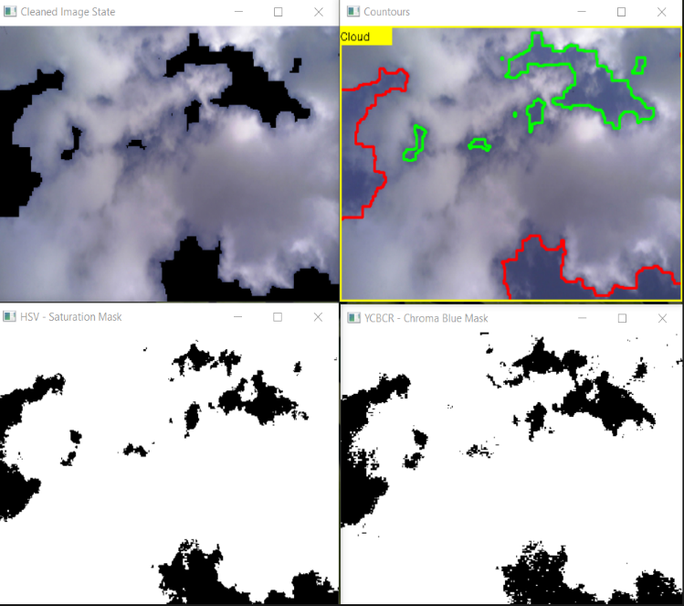

# SkyDeVision Imaging: Advanced Environmental Monitoring & Computer Vision Platform


A comprehensive environmental monitoring and computer vision platform that combines terrestrial imaging analysis with geospatial data processing. Revamp provides sophisticated tools for cloud detection, terrain visualization, camera calibration, and environmental data management.



## 🌟 Key Features

### 🔬 Advanced Computer Vision
- **Multi-Camera Support**: Compatible with OV2640, OV5640, DSLR, and mobile cameras
- **Intelligent Cloud Detection**: HSV/YCrCb color space analysis with morphological operations
- **Statistical Validation**: ROC curve analysis with Jaccard similarity metrics
- **Camera Calibration**: Comprehensive distortion correction and matrix calibration
- **Panoramic Stitching**: Automated image stitching with size optimization

### 🌍 Geospatial Intelligence
- **GeoTIFF Processing**: Advanced coordinate transformation and elevation data handling
- **3D Terrain Visualization**: Interactive plots using both Matplotlib and Plotly
- **Mesh Generation**: Configurable interpolation with smoothing and outlier detection

### 📊 Data Science & Analytics
- **Multi-Color Space Analysis**: RGB, HSV, and YCrCb processing pipelines
- **Bootstrap Sampling**: Statistical validation with configurable strata
- **Performance Optimization**: Numba JIT compilation for computationally intensive operations
- **Frequency Distribution Analysis**: Comprehensive histogram generation and comparison

### 🏗️ Production-Ready Architecture
- **Modular Design**: Clean separation of concerns with well-defined interfaces
- **Database Management**: SQLite with connection pooling and thread safety
- **Web Interface**: Flask-based dashboard with user authentication
- **Caching System**: LRU cache and pickle-based persistence for expensive operations

## 🚀 Quick Start

### Prerequisites
```bash
Python 3.9+
OpenCV 4.10+
GDAL/Rasterio for geospatial processing
```

### Installation
```bash
git clone https://github.com/sudoDeVinci/revamp.git
cd revamp
pip install -r requirements.txt
```
## 🧪 Methods

### Cloud Detection Pipeline
1. **Color Space Conversion**: BGR → HSV/YCrCb
2. **Threshold Masking**: Adaptive range-based segmentation
3. **Morphological Operations**: Erosion and dilation for noise reduction
4. **Contour Detection**: Hierarchical boundary identification
5. **Statistical Validation**: Bootstrap sampling with ROC analysis

### Terrain Processing
1. **Coordinate Transformation**: World file (.tfw) to XYZ mapping
2. **Outlier Detection**: IQR-based filtering
3. **Mesh Interpolation**: Configurable griddata interpolation
4. **Smoothing**: Gaussian and median filtering
5. **3D Rendering**: Surface plots with contour overlays
