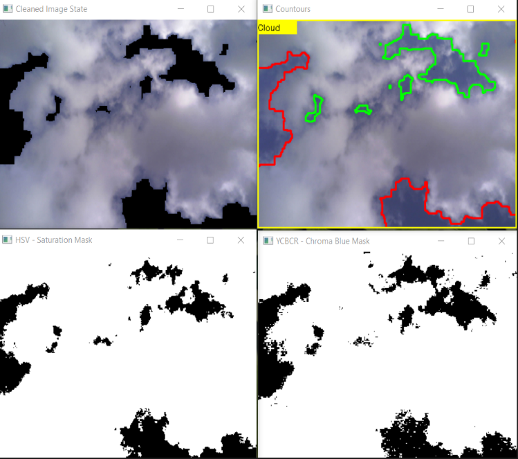

# SkyDeVision Imaging: Advanced Environmental Monitoring & Computer Vision Platform


<a href="https://lnu.diva-portal.org/smash/record.jsf?pid=diva2%3A1874520&dswid=4867"></a>


[](https://github.com/psf/black)
[](https://pydantic.dev)

A comprehensive environmental monitoring and computer vision platform that combines terrestrial imaging analysis with geospatial data processing. Revamp provides sophisticated tools for cloud detection, terrain visualization, camera calibration, and environmental data management.



## Key Features

### Computer Vision
- **Multi-Camera Support**: Compatible with OV2640, OV5640 and most DSLR, and mobile cameras
- **Intelligent Cloud Detection**: HSV/YCrCb/RGB color space analysis with morphological operations


### Geospatial Intelligence
- **3D Terrain Visualization**: Low-compute interactive data visualizations using both Matplotlib and Plotly.


### Data Science & Analytics
- **Performance Optimization**: Numba JIT compilation, and optional GPU offload through OpenCV.


### Uptime-Focused Design
- **Modular Design**: Separation of concerns with interfaces defined for ease of use.
- **Simplified Database Management**: SQLite3 with connection pooling and thread safety built in.

## Quick Start

### Installation
```bash
git clone https://github.com/sudoDeVinci/skyDeVisionImager.git
cd revamp
pip install -r requirements.txt
```